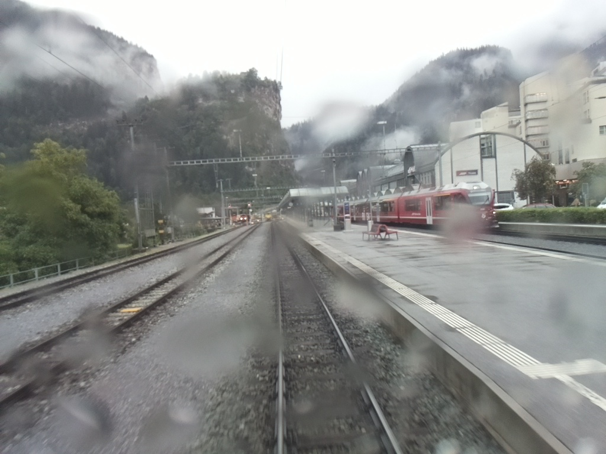
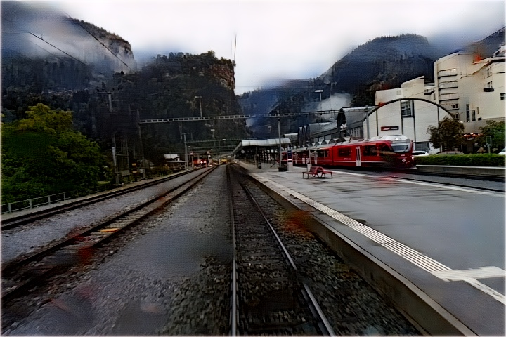
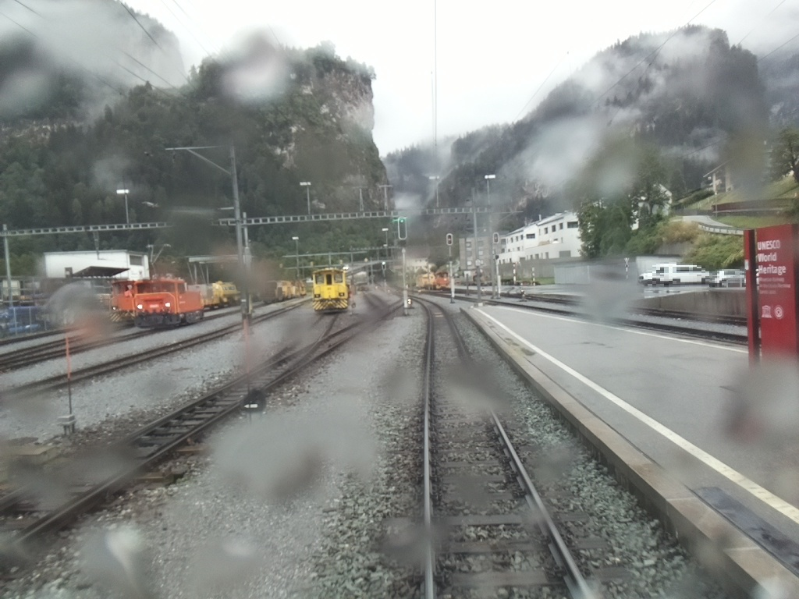
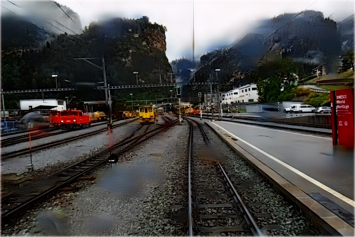
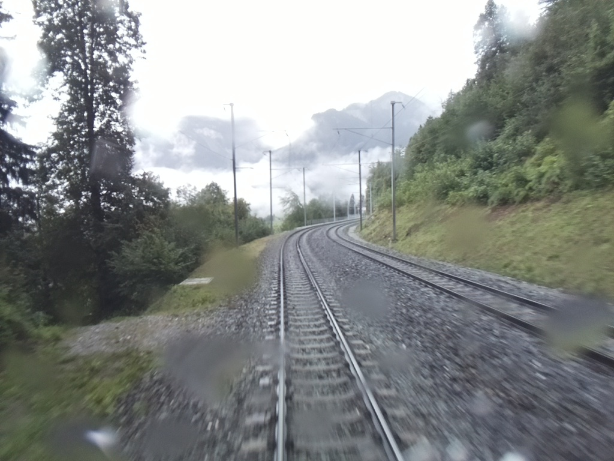
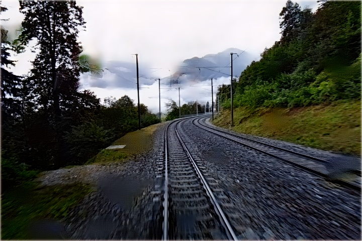
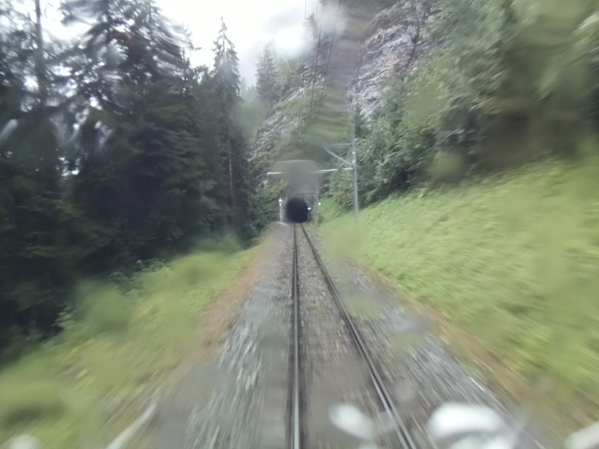
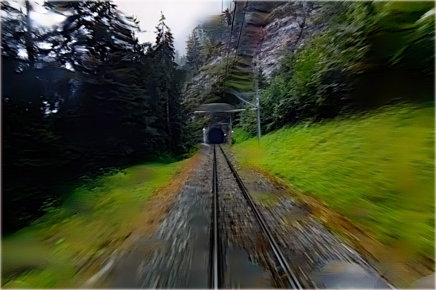

# FogProof


Bringing AI Magic to Railways!

This project was developed at HackZurich 2020 to participate at Siemense Mobility Challenge: [Lift the veil](http://hackzurich.siemens.cool/)


### Please check out our project [**demo**](https://www.youtube.com/watch?v=c1owO-VarWE&feature=youtu.be)

### :sparkles: Meet the team :sparkles:

1. Ahmed Nasr     -   Deep Learning Engineer
2. Mohamed Ayman  -   Frontend Engineer
3. Yomna Magdy    -   Backend Engineer

### How To Use

1. Download all required dependencies with this
```pip3 install -r requirements.txt```.

2. go to webApp and Run the app with: ```python3 app.py```

3. Go to this http://0.0.0.0:5000/

**Note**: [**Cuda**](https://developer.nvidia.com/cuda-downloads) and [**Cudnn**](https://developer.nvidia.com/cuda-downloads) is required for this to work.


### Results

Our code employs two different models the first is [DeRaindrop](https://github.com/rui1996/DeRaindrop) to remove rain drops and the second is [Image Unfogging](https://github.com/VPanjeta/Image-Unfogging) to remove fog. with suitable tuning and data preprocessing, vit gives very good results on the provided dataset.

Here are some of our results:


<p float="center">
   
   
</p>

<p float="center">
   
   
</p>

<p float="center">
   
   
</p>

<p float="center">
   
   
</p>


 


### :sparkles: Huge thanks for the real heroes who provided open source code for the latest research [DeRaindrop](https://github.com/rui1996/DeRaindrop) and [Image Unfogging](https://github.com/VPanjeta/Image-Unfogging) and also [AOD-Net](https://github.com/Boyiliee/AOD-Net):sparkles:


```
@inproceedings{ICCV17a,
  title={AOD-Net: All-in-One Dehazing Network},
  author={Li, Boyi and Peng, Xiulian and Wang, Zhangyang and Xu, Ji-Zheng and Feng, Dan},
  booktitle={Proceedings of the IEEE International Conference on Computer Vision},
  year={2017}
}

@article{pono,
  title={Positional Normalization},
  author={Li, Boyi and Wu, Felix and Weinberger, Kilian Q. and Belongie, Serge},
  journal={Advances in Neural Information Processing Systems},
  year={2019}
}

```

